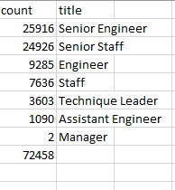

# Pewlett Hackard Analysis

## Overview: 
The company that has hired us has noticed that there will me a large number of employees that will retiring this year. Our job is to take the database that we created and use it to use queries to create tables to provide the data needed to analyze how large the outflow of employees will be from the silver wave.

## Results: 
- Of the total number of employees, only 1549 of about 443000 employees are eligible to be in the mentorship program
- There are 72458 positions that will need to be filled after the silver wave but there are only 1550 available to mentor employees to fill them.
- The company has enough employees on the payroll to replace the higher level roles but the retrictions on mentorship will hurt them.
- After the wave, a mass hiring spree will be needed as much of the losses will be from the movement of regular staff to senior staff so the staff will need to be replaced. 

## Summary:
- How many roles will need to be filled as the "silver tsunami" begins to make an impact?
There will be 72458 roles after the end of the wave. If the current employees are mentored to fill higher level positions, there will need to be an injection of new employees to fill the positions left by this movement.

- Are there enough qualified, retirement-ready employees in the departments to mentor the next generation of Pewlett Hackard employees?
There are 1549 employees that qualify for the mentorship program. When comparing this to the amount of positions needed to be filled, each of these mentors would need to mentor about 47 people. I think this is too much for one person so I believe that the requirements should be loosened. This will allow for more mentors and if needed mentors can be contracted. This will reduce cost of hiring new employees by lowered the amount of high-level positions that are needed to be filled. 

